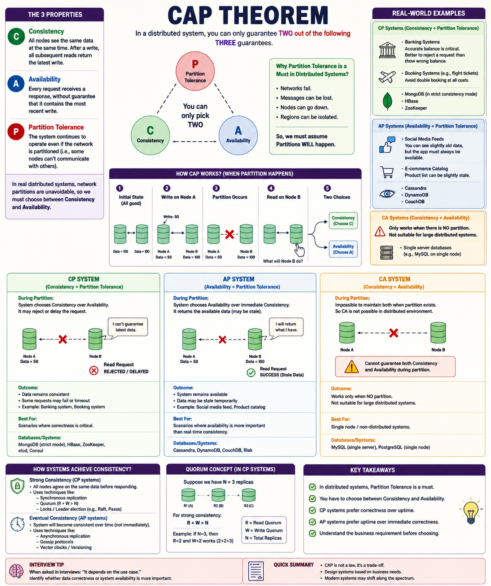
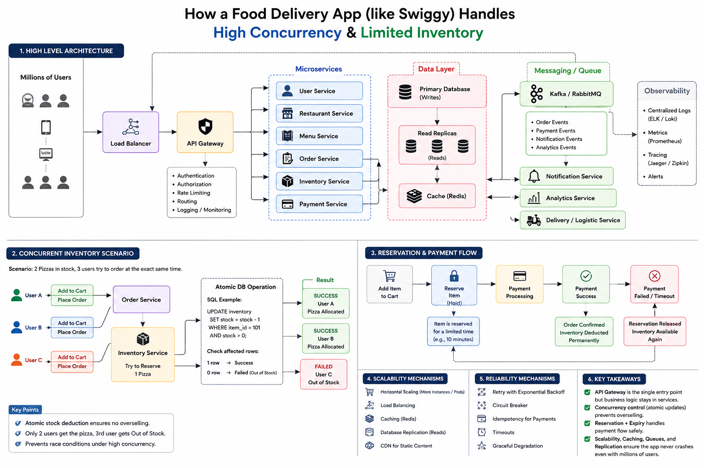

# CAP Theorem — Distributed Systems

> A practical, engineering-focused exploration of the **CAP Theorem**, distributed systems trade-offs, consistency models, partition handling, and real-world system design decisions.



---

## 📌 Overview

The **CAP Theorem** is one of the foundational concepts in distributed systems.

It explains a fundamental trade-off that occurs when a distributed system experiences a **network partition**:

> A distributed system cannot simultaneously guarantee strong **Consistency** and **Availability** while also tolerating a **Partition**.

In real-world distributed systems, network partitions are unavoidable. Therefore, system architects generally need to make a conscious trade-off between:

```text
                 CAP
                  │
                  P
            Partition Tolerance
                /     \
               /       \
              C         A
        Consistency  Availability
              \       /
               \     /
                CP / AP
```

This repository explains the concept from both a **theoretical** and **practical engineering** perspective.

---

## 🎯 Goals of This Repository

This project is designed to answer questions such as:

* What exactly does CAP Theorem mean?
* Why is Partition Tolerance important?
* What happens when two replicas lose communication?
* Why can't we guarantee both strong Consistency and Availability during a partition?
* When should a system prefer CP?
* When should a system prefer AP?
* What does eventual consistency actually mean?
* How do replication and quorum protocols work?
* How do real distributed databases handle these trade-offs?
* How should CAP influence system design decisions?

---

# 🧠 Core Concepts

## 1. Consistency

Consistency means that all clients observe the same latest committed state of the system.

For example:

```text
Initial State

Node A ─────── Node B
Balance = ₹100 Balance = ₹100
```

A successful write changes the balance:

```text
WRITE ₹50
     │
     ▼
Node A

Balance = ₹50
```

With strong consistency, a subsequent read should not return the old value:

```text
READ
 │
 ▼
Node B

Expected → ₹50
```

A system that cannot guarantee the latest value may reject or delay the operation.

---

## 2. Availability

Availability means that every valid request receives a response from the system.

For example:

```text
Client
  │
  ▼
Node A ─── X ─── Node B
           Network
          Partition
```

Even though Node A and Node B cannot communicate, an available system may continue serving requests.

The response may temporarily contain stale information depending on the consistency model.

---

## 3. Partition Tolerance

A network partition occurs when distributed nodes cannot communicate with each other.

```text
             NETWORK PARTITION
                    X
                   / \
                  /   \
                 /     \
            Node A    Node B
              │          │
           Data = 50  Data = 100
```

The nodes are still running, but communication between them has failed.

Partition tolerance means the system is designed to continue operating despite such failures.

### Why is P practically important?

Distributed systems operate across:

* Machines
* Availability zones
* Datacenters
* Regions
* Networks

Failures can occur because of:

* Network latency
* Packet loss
* Hardware failures
* Service crashes
* Datacenter outages
* DNS failures
* Cloud infrastructure failures

Therefore, production distributed systems generally have to assume that partitions can happen.

---

# ⚔️ What Happens During a Partition?

Consider two replicas:

```text
Before Partition

Node A                    Node B
Data = 100  ◄──────────►  Data = 100
```

A write occurs:

```text
WRITE = 50

Node A                    Node B
Data = 50   ◄──── X ────► Data = 100
                         Partition
```

Now a client sends:

```text
READ → Node B
```

Node B has two choices.

### Option 1 — Preserve Consistency

Node B cannot verify whether its value is current.

Therefore:

```text
READ
 │
 ▼
Node B
 │
 └── Cannot guarantee latest value
          │
          ▼
     Reject / Delay
```

Result:

```text
Consistency  ✅
Availability ❌
Partition Tolerance ✅
```

This is a **CP** approach.

---

### Option 2 — Preserve Availability

Node B returns the value it currently has:

```text
READ
 │
 ▼
Node B
 │
 └── Return available data
          │
          ▼
        ₹100
```

Result:

```text
Consistency  ❌
Availability ✅
Partition Tolerance ✅
```

This is an **AP** approach.

---

# 🔥 CP vs AP

| Property            | CP                           | AP                       |
| ------------------- | ---------------------------- | ------------------------ |
| Consistency         | Strong priority              | Relaxed / eventual       |
| Availability        | May be sacrificed            | Strong priority          |
| Partition Tolerance | Yes                          | Yes                      |
| During partition    | Reject / delay some requests | Continue serving         |
| Stale reads         | Avoided                      | Possible                 |
| Best for            | Correctness-critical systems | Highly available systems |

---

# 🟢 CP Systems

A CP system prioritizes:

```text
Consistency + Partition Tolerance
```

During a network partition:

```text
Correctness
    >
Availability
```

If the system cannot guarantee correct data, it may reject or delay the operation.

### Typical use cases

* Banking transactions
* Inventory reservation
* Distributed locks
* Booking systems
* Financial ledgers
* Critical metadata

### Example

Suppose only one flight seat remains:

```text
Available Seats = 1
```

Two users attempt to book simultaneously.

A system prioritizing correctness must prevent:

```text
User A → SUCCESS
User B → SUCCESS

❌ 2 bookings for 1 seat
```

Strong consistency is more important than temporarily accepting every request.

---

# 🔵 AP Systems

An AP system prioritizes:

```text
Availability + Partition Tolerance
```

During a partition:

```text
Availability
      >
Immediate Consistency
```

The system continues serving requests even if some responses are temporarily stale.

### Typical use cases

* Social media feeds
* Product catalogs
* Recommendation systems
* Analytics dashboards
* Content delivery
* Non-critical user activity

For example:

```text
User A creates post
        │
        ▼
    Replica A
        │
     Network
     delay
        │
        ▼
    Replica B
```

Replica B may temporarily not show the post.

Eventually:

```text
Replica A = Post X
Replica B = Post X
Replica C = Post X
```

This is **eventual consistency**.

---

# 🟡 What About CA?

CA means:

```text
Consistency + Availability
```

But without Partition Tolerance.

The problem is that once a network partition occurs, the system cannot guarantee both consistency and availability.

Therefore:

```text
CA
 │
 └── Requires no partition
```

This model is generally relevant to non-distributed or single-node environments rather than large distributed architectures.

---

# 🔄 Consistency Models

CAP should not be confused with the different consistency models used by distributed systems.

## Strong Consistency

After a successful write:

```text
WRITE X
  │
  ▼
All subsequent reads → X
```

The system provides a strong guarantee that reads observe the latest successful write.

---

## Eventual Consistency

Updates propagate asynchronously:

```text
        WRITE X
           │
           ▼
       Replica A
           │
     asynchronous
      replication
       /       \
      ▼         ▼
 Replica B   Replica C
```

For a period:

```text
A = X
B = Old
C = Old
```

Eventually:

```text
A = X
B = X
C = X
```

This allows systems to favor availability and scalability.

---

# 🗳️ Quorum

A common technique used in replicated systems is **quorum-based replication**.

Suppose:

```text
N = 3 replicas
```

```text
        ┌─────────┐
        │ Replica │
        │    A    │
        └─────────┘
             │
             │
        ┌────▼────┐
        │ Replica │
        │    B    │
        └─────────┘
             │
        ┌────▼────┐
        │ Replica │
        │    C    │
        └─────────┘
```

We can define:

```text
N = Total replicas
W = Write quorum
R = Read quorum
```

A common quorum condition is:

```text
R + W > N
```

For example:

```text
N = 3
R = 2
W = 2
```

Then:

```text
R + W = 4

4 > 3
```

Therefore, read and write quorums overlap, helping reads observe the latest acknowledged write under the assumptions of the chosen protocol.

> Quorum mathematics alone does not automatically guarantee linearizability; the complete replication and conflict-resolution protocol matters.

---

# 🏗️ Distributed System Architecture

A simplified replicated architecture:

```text
                     ┌──────────────┐
                     │    Client    │
                     └──────┬───────┘
                            │
                            ▼
                     ┌──────────────┐
                     │ Load Balancer│
                     └──────┬───────┘
                            │
                 ┌──────────┼──────────┐
                 ▼          ▼          ▼
              Node A     Node B     Node C
                 │          │          │
                 └──────────┼──────────┘
                            │
                       Replication
                            │
                 ┌──────────┴──────────┐
                 │                     │
          Strong Consistency    Eventual Consistency
                 │                     │
                CP                    AP
```

The exact architecture depends on:

* Replication strategy
* Leader election
* Consensus protocol
* Quorum configuration
* Failure detection
* Conflict resolution
* Data model
* Business requirements

---

# 🧩 CAP Is a Business Decision Too

CAP should not be treated as:

```text
"Database X = CP"
"Database Y = AP"
```

Real architecture decisions depend on the **specific workload and consistency requirements**.

Ask:

### 1. Can stale data be tolerated?

```text
YES → AP may be appropriate
NO  → Stronger consistency may be required
```

### 2. Can requests be rejected during failures?

```text
YES → CP may be acceptable
NO  → Availability becomes more important
```

### 3. What is the business impact?

For example:

```text
Social Feed
     ↓
Stale post for a few seconds
     ↓
Usually acceptable
```

But:

```text
Bank Account
     ↓
Incorrect balance
     ↓
Potentially unacceptable
```

---

# 🌍 Real-World Design Examples

## Banking

Priority:

```text
Consistency
     >
Availability
```

Incorrect financial state can be significantly more damaging than temporarily rejecting a transaction.

---

## Social Media

Priority:

```text
Availability
     >
Immediate Consistency
```

A slightly stale feed is generally preferable to making the entire feed unavailable.

---

## E-Commerce Catalog

Product information can often tolerate temporary replication lag.

```text
Product updated
      │
      ▼
Replica A → New price
Replica B → Old price
      │
      ▼
Eventually synchronized
```

The exact consistency requirement depends on the field. Pricing during checkout, for example, may require stronger guarantees than a cached product description.

---

## Seat / Inventory Reservation

A limited resource creates a stronger consistency requirement:

```text
1 seat
│
├── User A → reserve
└── User B → reserve
```

The system must prevent overselling.

This often requires stronger coordination than a normal read-heavy catalog.

---

# ⚠️ Common CAP Misconceptions

### ❌ "CAP means you can freely choose any two."

Oversimplified.

The important point is:

> **When a partition occurs, a distributed system cannot guarantee both strong consistency and availability simultaneously.**

---

### ❌ "CAP consistency is the same as ACID consistency."

They are different concepts.

CAP:

```text
Distributed-system consistency
```

ACID:

```text
Transaction consistency
```

---

### ❌ "AP means the system has no consistency."

Wrong.

AP systems can provide **eventual consistency** or other weaker consistency guarantees.

---

### ❌ "CP means the system is always unavailable."

Wrong.

CP systems are generally available during normal operation.

The trade-off becomes important **during a partition**.

---

### ❌ "One database is always CP and another is always AP."

Too simplistic.

Modern distributed databases may support different consistency levels, replication strategies, and configurations.

---

# 🧪 Practical Implementation Roadmap

This repository will eventually contain small implementations demonstrating these concepts.

```text
Phase 1
  │
  ├── CAP fundamentals
  ├── Consistency
  ├── Availability
  └── Partition Tolerance
       │
       ▼
Phase 2
  │
  ├── CP simulation
  ├── AP simulation
  └── Network partition simulation
       │
       ▼
Phase 3
  │
  ├── Replication
  ├── Leader / Follower
  ├── Quorum
  └── Failure handling
       │
       ▼
Phase 4
  │
  ├── Eventual consistency
  ├── Conflict resolution
  └── Retry / timeout behaviour
       │
       ▼
Phase 5
  │
  └── Production-style distributed system
```

---

# 📁 Repository Structure

```text
cap-theorem/
│
├── README.md
│
├── diagrams/
│   └── cap-theorem-overview.png
│
├── notes/
│   ├── 01-cap-theorem.md
│   ├── 02-consistency.md
│   ├── 03-availability.md
│   ├── 04-partition-tolerance.md
│   ├── 05-cp-vs-ap.md
│   └── 06-real-world-examples.md
│
└── examples/
    ├── cp-system/
    └── ap-system/
```

---

# 🎓 Interview Perspective

When asked:

> **"Explain CAP Theorem."**

A strong answer should not simply say:

```text
CAP = Consistency + Availability + Partition Tolerance
```

Instead, explain the failure scenario:

```text
Normal State
     │
     ▼
Replicas communicate
     │
     ▼
Network Partition
     │
     ├───────────────┐
     ▼               ▼
Choose C           Choose A
     │               │
     ▼               ▼
CP                AP
Reject/Delay      Serve available data
```

Then connect the choice to the business requirement.

---

# 💡 Key Takeaways

* CAP applies to **distributed systems**.
* Partition tolerance is a fundamental requirement for systems operating across unreliable networks.
* During a partition, strong consistency and availability cannot both be guaranteed.
* **CP** prioritizes correctness/consistency during partitions.
* **AP** prioritizes availability during partitions.
* AP systems can use eventual consistency.
* CAP is not simply a database-labeling exercise.
* Real architecture depends on workload and business requirements.
* Quorum, replication, consensus, and conflict resolution are important implementation mechanisms.
* The right question is not **"Which CAP type is better?"**
* The right question is:

> **"What guarantees does this business operation actually require?"**

---

## 🚀 Next Topics

This repository will continue with:

```text
CAP Theorem
     ↓
Consistency Models
     ↓
Replication
     ↓
Quorum
     ↓
Leader Election
     ↓
Consensus
     ↓
Raft
     ↓
Sharding
     ↓
Consistent Hashing
     ↓
Distributed Transactions
     ↓
Eventual Consistency
     ↓
Conflict Resolution
     ↓
Production System Design
```

---

## 👨‍💻 Author

**Vishal Singh**

B.Tech Computer Science & Engineering

Focused on:

* Java
* Spring Boot
* Backend Engineering
* Distributed Systems
* System Design
* Data Structures & Algorithms

---

> **System Design Principle:**
> Don't choose technology first. Define the guarantees your system needs, understand the failure modes, and then choose the architecture.


---

# 🚦 High-Concurrency Food Delivery System

A practical system-design exploration of how a food-delivery platform such as Swiggy can handle **millions of concurrent users**, route requests through an API Gateway, and prevent **inventory overselling** when multiple users attempt to purchase the same limited item simultaneously.



## 🏗️ High-Level Architecture

```text
                         Millions of Users
                                │
                                ▼
                         Load Balancer
                                │
                                ▼
                          API Gateway
                                │
              ┌─────────────────┼─────────────────┐
              ▼                 ▼                 ▼
        User Service      Order Service     Restaurant Service
                                │
                                ▼
                        Inventory Service
                                │
                    ┌───────────┴───────────┐
                    ▼                       ▼
               Redis Cache             Database
                                            │
                                      Read Replicas

                                │
                                ▼
                         Kafka / RabbitMQ
                     ┌──────────┼──────────┐
                     ▼          ▼          ▼
                Payment   Notification  Analytics
```

### API Gateway Responsibilities

The API Gateway acts as the **single entry point** for client requests.

Typical responsibilities include:

- Request routing
- Authentication
- Authorization
- Rate limiting
- Request filtering
- Centralized logging and monitoring

The API Gateway does **not** own business logic such as deciding which user gets the last pizza. That responsibility belongs to the appropriate domain service, such as the Order or Inventory Service.

---

## 🔥 Concurrent Inventory Problem

Consider a restaurant with:

```text
Pizza Stock = 2
```

Three users send requests at nearly the same time:

```text
User A ─┐
User B ─┼──> Order Service ──> Inventory Service
User C ─┘
```

A naive implementation could cause a race condition:

```text
User A → Read stock = 2
User B → Read stock = 2
User C → Read stock = 2

All three believe the item is available.
```

This can result in **overselling** if the inventory update is not concurrency-safe.

### Atomic Inventory Deduction

A safer approach is to make the stock deduction atomic:

```sql
UPDATE inventory
SET stock = stock - 1
WHERE item_id = 101
AND stock > 0;
```

Then inspect the affected-row count:

```text
1 row affected → Reservation successful
0 rows affected → Out of stock
```

For two pizzas and three concurrent users:

```text
Initial stock = 2

User A → SUCCESS → stock = 1
User B → SUCCESS → stock = 0
User C → FAILED  → Out of Stock
```

The important guarantee is:

```text
2 available items
        ↓
2 successful allocations
        ↓
1 rejected request
        ↓
No overselling
```

---

## 🔐 Reservation + Payment Flow

Inventory allocation becomes more complex when payment is involved.

A robust flow can use a temporary reservation:

```text
Add Item to Cart
       │
       ▼
Reserve Item
       │
       ▼
Temporary Hold
       │
       ▼
Payment Processing
      / \
     /   \
    ▼     ▼
Success  Failed / Timeout
   │          │
   ▼          ▼
Confirm     Release
Order       Reservation
   │          │
   ▼          ▼
Inventory   Item Available
Deducted     Again
```

A reservation can have an expiry time. If payment does not complete within that period, the reservation is released so another customer can purchase the item.

---

## ⚡ Handling Millions of Concurrent Users

A production-scale system cannot depend on one application instance.

Common scalability mechanisms include:

```text
Horizontal Scaling
        +
Load Balancing
        +
Caching
        +
Database Replication
        +
Asynchronous Messaging
```

### Horizontal Scaling

```text
Order Service
     │
 ┌───┼───┬───┐
 ▼   ▼   ▼   ▼
Pod Pod Pod Pod
```

More instances can handle increased traffic.

### Caching

Frequently accessed data can be served through Redis to reduce database load.

### Database Replication

Read replicas can handle read-heavy workloads while the primary database handles writes.

### Messaging

Kafka/RabbitMQ can decouple asynchronous operations such as:

- Notifications
- Analytics
- Order events
- Payment events
- Other background processing

---

## 🛡️ Reliability and Failure Handling

Large distributed systems assume that failures will happen.

Important techniques include:

- Timeouts
- Retries with backoff
- Circuit breakers
- Idempotency
- Graceful degradation
- Health checks
- Centralized logging
- Metrics
- Distributed tracing

### Payment Idempotency

If a payment request is retried because of a network failure, the system must avoid charging the customer twice.

An idempotency key can associate multiple retries with the same logical payment operation:

```text
Payment Request
      │
      ▼
Idempotency Key
      │
      ├── First request → Process payment
      │
      └── Retry        → Return existing result
```

---

## 🎯 System Design Principles Learned

The key lesson from this scenario is that **API Gateway, scalability, and concurrency control solve different problems**.

| Problem | Main mechanism |
|---|---|
| Route requests to services | API Gateway |
| Handle millions of requests | Load Balancing + Horizontal Scaling |
| Prevent inventory overselling | Atomic Updates + Transactions |
| Temporarily hold inventory | Reservation + Expiry |
| Avoid duplicate payments | Idempotency |
| Reduce database reads | Caching |
| Handle asynchronous work | Kafka / RabbitMQ |
| Survive service failures | Timeout + Retry + Circuit Breaker |
| Scale read-heavy workloads | Database Replication |

> **System design is not about adding more components. It is about choosing the right guarantees and mechanisms for each failure and concurrency scenario.**


---

# 🚀 CI/CD Pipeline — How It Works

A practical overview of how modern software teams automate **build, test, delivery, deployment, and monitoring** using a CI/CD pipeline.


## 📌 What is CI/CD?

**CI/CD** stands for **Continuous Integration** and **Continuous Delivery / Continuous Deployment**.

```text
Developer writes code
        │
        ▼
Commit & Push to Git
        │
        ▼
Continuous Integration (CI)
        │
        ├── Checkout source code
        ├── Install dependencies
        ├── Build application
        ├── Run tests
        ├── Code quality / security checks
        └── Create artifact
        │
        ▼
Artifact Repository
        │
        ▼
Continuous Delivery / Deployment (CD)
        │
        ├── Deploy to Development
        ├── Integration Tests
        ├── Deploy to Staging
        ├── Acceptance Tests
        └── Deploy to Production
        │
        ▼
Application Live
        │
        ▼
Monitoring & Logging
```

CI/CD reduces manual deployment work and helps teams release software faster and more consistently.

---

## 🔵 Continuous Integration (CI)

Continuous Integration means developers frequently merge code into a shared repository and every change is automatically validated.

A typical CI flow is:

```text
Code Push
   │
   ▼
Checkout Code
   │
   ▼
Install Dependencies
   │
   ▼
Build
   │
   ▼
Unit Tests
   │
   ▼
Code Quality / Security Scan
   │
   ▼
Create Artifact
```

If the build or tests fail, the pipeline stops and the issue should be fixed before deployment.

---

## 🟣 Continuous Delivery / Deployment (CD)

After CI successfully produces a deployable artifact, the CD pipeline moves that artifact through environments.

```text
Artifact
   │
   ▼
Development
   │
   ▼
Integration Tests
   │
   ▼
Staging
   │
   ▼
Acceptance Tests
   │
   ▼
Production
```

**Continuous Delivery** keeps the application ready for production, while the final production release may require approval.

**Continuous Deployment** automatically deploys every change that successfully passes the pipeline.

---

## 📦 Artifact Repository

The CI pipeline should create an immutable deployable artifact instead of rebuilding the application separately for every environment.

Examples include:

- JAR / WAR files
- Docker images
- Versioned application packages

Artifact repositories such as **Docker Hub, Nexus, or Artifactory** can store these build outputs.

```text
CI Build
   │
   ▼
Docker Image / JAR
   │
   ▼
Artifact Repository
   │
   ▼
CD Pipeline
```

---

## ☕ Spring Boot CI/CD Example

Consider a Java Spring Boot backend.

```text
Developer
   │
   ▼
GitHub
   │
   ▼
GitHub Actions / Jenkins
   │
   ▼
Maven Build
   │
   ▼
JUnit Tests
   │
   ▼
JAR Created
   │
   ▼
Docker Image Built
   │
   ▼
Docker Registry
   │
   ▼
Kubernetes
   │
   ▼
Production
```

A possible execution flow is:

1. Developer pushes code to GitHub.
2. GitHub Actions or Jenkins detects the change.
3. Maven compiles and builds the application.
4. JUnit tests run automatically.
5. A deployable JAR is created.
6. A Docker image is built.
7. The image is pushed to an artifact/container registry.
8. Kubernetes pulls the new image.
9. The new application version is deployed.
10. Health checks and monitoring verify the deployment.

---

## 🛠️ Common CI/CD Tools

| Stage | Common Tools |
|---|---|
| Source Control | GitHub, GitLab, Bitbucket |
| CI | Jenkins, GitHub Actions, GitLab CI, CircleCI |
| Build | Maven, Gradle, npm |
| Testing | JUnit, Selenium, pytest |
| Containerization | Docker |
| Artifact Repository | Docker Hub, Nexus, Artifactory |
| Orchestration | Kubernetes |
| Deployment | Argo CD, Helm, Spinnaker |
| Monitoring | Prometheus, Grafana |

---

## 🏗️ Real-World Pipeline Architecture

```text
Developer
   │
   ▼
Git Repository
   │
   ▼
CI Server
   │
   ├── Build
   ├── Test
   └── Security / Quality Checks
   │
   ▼
Artifact Registry
   │
   ▼
CD
   │
   ▼
Kubernetes Cluster
   │
   ▼
Application
   │
   ▼
Monitoring + Logging
```

The important idea is that **the exact same tested artifact should move through environments** rather than rebuilding different versions for development, staging, and production.

---

## 🛡️ Production Considerations

A production CI/CD pipeline should also consider:

- Secrets management
- Environment-specific configuration
- Automated testing
- Security scanning
- Health checks
- Deployment approvals when required
- Rollback strategy
- Blue-green or canary deployments
- Monitoring and alerting
- Audit logs

If the newly deployed version fails health checks or causes errors, the system should support quickly rolling back to a known stable version.

---

## 🎯 Benefits of CI/CD

- Faster software releases
- Early bug detection
- Reduced manual deployment effort
- Repeatable and consistent deployments
- Easier rollback
- Better collaboration between developers and operations
- Improved reliability and scalability of the release process

---

## 🎓 Interview Perspective

When asked **"How does a CI/CD pipeline work?"**, a strong short answer is:

> A developer pushes code to a Git repository, which triggers the CI pipeline. The pipeline builds the application, runs automated tests and quality checks, and creates a versioned artifact such as a JAR or Docker image. The CD pipeline then promotes the same tested artifact through development and staging and finally deploys it to production. After deployment, health checks, logs, and metrics are monitored, with rollback mechanisms available if the release fails.

The key flow to remember is:

```text
Code
 ↓
Git Push
 ↓
Build
 ↓
Test
 ↓
Package
 ↓
Artifact
 ↓
Deploy
 ↓
Monitor
```

> **CI/CD Principle:** Build once, test automatically, deploy the same version consistently, and always be able to detect and recover from a bad release.
